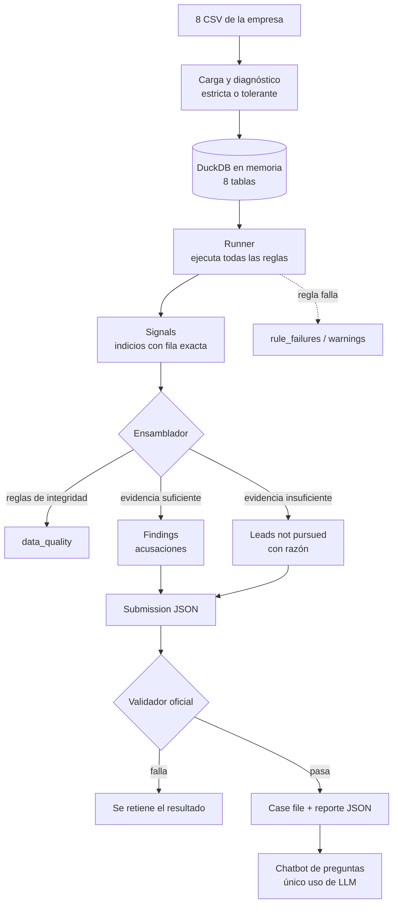

# Cómo funciona el motor forense

> Explicación conceptual, de punta a punta, de cómo el sistema investiga una empresa y
> entrega un expediente de caso. Para la referencia técnica de la API (payloads, códigos
> de error, tablas de PostgreSQL) ver [`fraud_engine.md`](fraud_engine.md).

---

## 1. En resumen

1. Recibe los **8 archivos CSV** de la contabilidad de una empresa (proveedores, facturas,
   libro mayor, banco, órdenes de compra, contratos, empleados y lista EFOS del SAT).
2. Revisa primero la **calidad de los datos** y luego corre **reglas de detección** escritas
   en SQL, agrupadas por los 5 tipos de fraude del reto.
3. Cada regla produce **señales** (indicios que apuntan a un registro exacto). Una señal
   **no es una acusación**.
4. Un **ensamblador** junta las señales por esquema y decide: **acusa** solo si la evidencia
   es independiente, suficiente y tiene monto en pesos; si no, **descarta la pista y explica
   por qué**.
5. Entrega un `submission.json` que pasa el validador oficial y un **case file** legible con
   el rastro del dinero.

---

## 2. Principios de diseño

| Principio | Qué significa | Por qué importa |
|---|---|---|
| **Determinista** | Mismo CSV + mismo `seed` ⇒ mismo `submission.json` (hallazgos, montos, razones y exhibits). La única excepción es `run_metadata.wall_clock_seconds`, que es tiempo de ejecución y se trata como metadato operativo. `run_metadata.deterministic = true`. | Los jueces pueden correr el mismo seed dos veces; un auditor puede reproducir el caso. |
| **Sin LLM en la detección** | Reglas SQL, umbrales fijos, decisiones con reglas explícitas y narrativas por plantilla. `llm_calls = 0`, `mxn_cost = 0`. | Nada se "inventa": cada frase sale de un dato calculado. Costo cero y sin límites de API. |
| **LLM solo en el chatbot** | Un modelo local opcional (Ollama) responde preguntas **sobre un reporte ya generado**. Recibe un resumen permitido: hallazgos, pistas descartadas, reglas, conciliaciones y registros citados; nunca el CSV completo, CLABEs/direcciones, ground truth ni razonamiento interno. No re-ejecuta ni cambia hallazgos ni montos. | Se puede conversar con el reporte sin romper el determinismo ni exponer información que no se necesita para explicar el caso. |
| **Offline** | Corre sobre DuckDB en memoria, sin red. `fraud-replay` reproduce una corrida localmente. | Requisito del reto: el case file debe poder regenerarse sin conexión. |
| **Probar antes de acusar** | Se exigen ≥2 familias de evidencia independientes (o una regla suficiente sola), ≥3 registros citados y un monto que reconcilie. | Acusar a un proveedor honesto (decoy) pesa tanto como no encontrar el fraude. |
| **Trazable** | Cada señal y cada exhibit apuntan a la llave primaria de **una fila concreta**. | Cualquier número del reporte se puede verificar abriendo la fila citada. |
| **Aislamiento de las respuestas** | El *ground truth* vive solo en `evaluation/`; nada en `app/` lo importa o lo lee. Las cargas ignoran carpetas `private/`. | Evita "hacer trampa" y es algo que los jueces verifican con `grep`. |

---

## 3. Flujo completo



---

## 4. Etapa 1 · Entrada y calidad de datos

### Las 8 tablas

| Tabla | Qué contiene |
|---|---|
| `vendors` | Catálogo de proveedores: RFC, razón social, fecha de alta, CLABE, categoría. |
| `invoices` | Facturas CFDI: emisor, receptor, subtotal, IVA, total, estatus (`vigente`/`cancelado`). |
| `ledger` | Libro mayor: asientos con cargo/abono, cuenta, factura ligada y quién aprobó. |
| `bank_txns` | Movimientos bancarios: CLABE origen y destino, monto, canal. |
| `purchase_orders` | Órdenes de compra: proveedor, monto, solicitante y aprobador. |
| `contracts` | Contratos con proveedores: valor y alcance. |
| `employees` | Empleados: puesto y CLABE (para detectar pagos a empleados). |
| `efos_list` | Lista del SAT Art. 69-B: RFC y estatus `definitivo` / `presunto`. |

### Dos formas de cargar

- **Estricta** (`POST /fraud/analyze`, `fraud-replay`): exige las 8 tablas con las columnas
  exactas y reporta **todos** los errores juntos (archivo, columna, mensaje).
- **Tolerante** (flujo de *runs*): al subir el dataset se genera un diagnóstico por tabla
  (`ok` / `warning` / `error`). Si el usuario acepta las advertencias, una tabla opcional
  faltante se crea vacía, una columna faltante queda en `NULL` y un valor que no se puede
  convertir queda en `NULL`. Con datos limpios, ambas cargas dan el mismo resultado.

### Reglas de integridad de datos

Los datos tienen que poder cruzarse: si un RFC está mal capturado, el proveedor EFOS no
aparece; si una CLABE tiene un dígito de menos, el pago no se liga a nadie. Estas reglas
señalan esos defectos para que el auditor sepa qué tan confiables son los cruces.

| Regla | Pregunta que responde |
|---|---|
| `LEDGER_UNBALANCED_ENTRY` | ¿Hay pólizas donde los cargos no igualan a los abonos (más de $0.01)? |
| `ORPHAN_INVOICE_UUID` | ¿Hay asientos contables que citan una factura que no existe? |
| `MALFORMED_RFC` | ¿Hay RFC con longitud o caracteres inválidos? |
| `CLABE_INVALID_LENGTH` | ¿Hay proveedores o empleados con CLABE que no tiene 18 dígitos? |

- Son **autosuficientes**: el defecto se comprueba directamente en el dato.
- **Nunca acusan a nadie.** Se reportan aparte, como conteos en `data_quality`.
- **No bloquean el análisis.** El runner las ejecuta junto con las demás (son las últimas en
  el orden) y un dato defectuoso no detiene a las reglas de fraude: solo queda reportado.

**Dónde está en el código:** `app/fraud/engine/ingesta.py`, `app/runs/ingest.py`,
`app/fraud/loader.py`, `app/fraud/rules/data_integrity/`.

---

## 5. Etapa 2 · Detección: reglas por tipo de fraude

Cada regla responde **una pregunta concreta** sobre los datos. Columnas de las tablas:

- **Familia:** qué tipo de evidencia aporta. Dos reglas de la misma familia miran el mismo
  hecho y **no se corroboran entre sí**.
- **¿Basta sola?:** si puede sostener una acusación sin una segunda familia.

> **No confundir "basta sola" con "autosuficiente".** Son dos propiedades distintas:
>
> - **Basta sola** decide **si se acusa**. Solo `EFOS_DIRECT_MATCH` y
>   `PAYMENT_TO_EMPLOYEE_ACCOUNT`.
> - **Autosuficiente** decide **la confianza** (`proven` / `probable`). Solo
>   `PAYMENT_TO_EMPLOYEE_ACCOUNT`, `NO_SEGREGATION_OF_DUTIES` y `SAME_APPROVER_SPLIT` (además
>   de las reglas de integridad). Las demás son `presuntiva`.
>
> Por eso `EFOS_DIRECT_MATCH` puede acusar sola pero da `probable` (la lista del SAT es una
> presunción que la empresa puede desvirtuar), y `SAME_APPROVER_SPLIT` da `proven` pero aun así
> necesita una segunda familia (varias órdenes seguidas también pueden ser compras legítimas).

### 5.1 `phantom_vendor` — proveedor fantasma

Un proveedor que vende facturas, no bienes ni servicios (EFOS, Art. 69-B CFF).

| Regla | Qué detecta | Familia | ¿Basta sola? |
|---|---|---|---|
| `EFOS_DIRECT_MATCH` | Facturas de un proveedor que el SAT ya confirmó como EFOS (`definitivo`). | lista_sat | **Sí** |
| `EFOS_PRESUNTO_MATCH` | Facturas de un proveedor que el SAT investiga (`presunto`). | lista_sat | No |
| `EFOS_POST_DATED` | Facturas de un EFOS emitidas antes de que el SAT lo publicara. | lista_sat | No |
| `VENDOR_SHORT_LIFECYCLE` | Proveedor que empezó a facturar menos de 30 días después de darse de alta. | alta_reciente | No |
| `INVOICE_NO_PO_NO_CONTRACT` | Facturas mayores a $50,000 sin orden de compra ni contrato. | sin_materialidad | No |
| `SHARED_CLABE_MULTI_RFC` | Varios proveedores distintos cobran en la misma cuenta bancaria. | cuenta_compartida | No |

Además, `OUTBOUND_TO_SUSPECT_ENTITY` (transferencias a un EFOS o a una CLABE compartida) se
cuenta aquí como regla **derivada**: aporta citas, pero no suma una familia.

### 5.2 `kickback` — moche o comisión indebida

Dinero que regresa a un empleado, normalmente a quien aprueba las compras.

| Regla | Qué detecta | Familia | ¿Basta sola? |
|---|---|---|---|
| `PAYMENT_TO_EMPLOYEE_ACCOUNT` | Pagos bancarios que llegan a la CLABE de un empleado. | pago_a_empleado | **Sí** |
| `APPROVER_VENDOR_CONCENTRATION` | Un aprobador autoriza muchas facturas de un mismo proveedor (más de 5, al menos 2× su cuota normal). | concentracion_aprobador | No |
| `NO_SEGREGATION_OF_DUTIES` | La misma persona solicita y aprueba una orden de compra. | segregacion | No |
| `PRICE_OUTLIER_BY_CATEGORY` | Facturas con precio a más de 2 desviaciones estándar de su categoría. | sobreprecio | No |

Si la CLABE del empleado también está registrada a un proveedor, el pago se cuenta como
`phantom_vendor` (es el mismo dinero; así no se reclama dos veces).

### 5.3 `round_tripping` — dinero que da la vuelta

Dinero que sale y regresa, directo o por intermediarios, para simular operaciones.

| Regla | Qué detecta | Familia | ¿Basta sola? |
|---|---|---|---|
| `BANK_CYCLE_2NODE` | A paga a B y B le devuelve casi lo mismo en ≤30 días (±10%). | ciclo_bancario | No |
| `BANK_CYCLE_NNODE` | El dinero vuelve a su origen tras pasar por hasta 5 cuentas en ≤60 días. | ciclo_bancario | No |
| `CYCLE_LEAKAGE_RATE` | Una cuenta participa en ciclos repetidos quedándose una comisión pequeña (≤10%). | comision_repetida | No |
| `INVOICE_BIDIRECTIONAL` | Dos empresas se facturan mutuamente montos parecidos en ≤90 días. | factura_espejo | No |
| `BANK_TXN_NOT_IN_LEDGER` | Entró o salió dinero sin ningún asiento contable. | sin_registro_contable | No |

### 5.4 `threshold_splitting` — fraccionamiento de compras

Partir una compra grande en varias chicas para que ninguna requiera autorización superior.

| Regla | Qué detecta | Familia | ¿Basta sola? |
|---|---|---|---|
| `SAME_APPROVER_SPLIT` | ≥2 órdenes al mismo proveedor en 7 días, mismo aprobador, que juntas superan $50,000. | ordenes_fraccionadas | No |
| `CONTRACT_SPLIT_INTO_POS` | Un contrato cuyo valor coincide (±2%) con la suma de ≥2 órdenes emitidas en sus primeros 7 días. | contrato_fraccionado | No |

### 5.5 `revenue_inflation` — inflado de ingresos

Registrar ventas que no existieron. Aquí quien comete el fraude es **la propia empresa**, así
que su RFC sí es acusable (en los demás esquemas la empresa es la víctima).

| Regla | Qué detecta | Familia | ¿Basta sola? |
|---|---|---|---|
| `INFLATE_AND_CANCEL` | Facturas canceladas cuyo registro contable no se revirtió (el ingreso sigue en libros). | cancelada_sin_reversion | No |
| `AR_AGING_EXCESSIVE` | Cuentas por cobrar abiertas más de 90 días sin ningún cobro. | cxc_sin_cobro | No |

> Los umbrales son los valores por defecto de cada función. El catálogo también lista reglas
> todavía no implementadas (p. ej. `PO_NEAR_THRESHOLD`, `BENFORD_DEVIATION_*`,
> `PERIOD_END_SPIKE`); `GET /fraud/rules` las muestra con `implemented: false`.

**Dónde está en el código:** `app/fraud/rules/<esquema>/` (un archivo por regla, cada carpeta
con su README detallado) y `app/fraud/engine/catalogo.py` (regla → esquema, familia, norma).

---

## 6. Etapa 3 · Runner y el contrato *Signal*

### Qué es una regla

Una **función pura**: `rule_<id>(con, <umbrales con default>) -> DataFrame`.

- Ejecuta SQL de **solo lectura** sobre DuckDB, con parámetros `?` (sin concatenar texto).
- No depende de otras reglas ni de estado global.
- Se registra en la lista `RULES` de su paquete; una regla que no está en `RULES` nunca corre.

### Qué es una *Signal*

Cada fila que devuelve una regla es una señal. Las 8 primeras columnas son obligatorias y en
este orden:

| Columna | Significado |
|---|---|
| `rule_id` | Qué regla la produjo (constante en toda la tabla de esa regla). |
| `source_table` | Tabla donde está la evidencia. |
| `entity_id` | A quién apunta: RFC, empleado, CLABE o factura. |
| `evidence_id` | Llave primaria de **la fila exacta** que prueba el indicio. |
| `fecha_deteccion` | Fecha del hecho detectado. |
| `severidad` | `alta` / `media` / `baja`: qué tan grave es el indicio. |
| `autosuficiencia` | `autosuficiente` (el dato prueba el hecho por sí solo) o `presuntiva` (necesita corroboración). |
| `monto` | Pesos involucrados, si aplica. |

Las columnas extra de la regla (p. ej. `approver`, `efos_status`, `evidence_ids_relacionados`)
se guardan como `contexto` en JSON.

### Qué hace el runner

1. Corre **todas** las reglas registradas, en orden fijo.
2. **Valida el contrato** de cada resultado: columnas, `rule_id` constante, valores válidos de
   severidad y autosuficiencia.
3. **Aísla fallos:** si una regla lanza error o rompe el contrato, se omite, se reporta en
   `rule_failures` y `warnings`, y las demás siguen corriendo.
4. Concatena todas las señales y devuelve el conteo por regla (`signals_per_rule`).

**Dónde está en el código:** `app/fraud/engine/runner.py`, `app/fraud/rules/__init__.py`.

---

## 7. Etapa 4 · Ensamblador: de señales a acusaciones

Aquí se decide quién se acusa. Es el paso que separa "marcar cosas raras" de "probar un caso".

### Paso a paso

1. **Identificar a la empresa auditada y resolver entidades.** La empresa auditada es el RFC
   que aparece en más facturas (como emisor o receptor); sus CLABEs se reconocen como propias.
   Luego cada señal se traduce a una parte identificable: un proveedor (`RFC:…`), un empleado
   (`EMP:…`) o el dueño de una CLABE. Un aprobador se liga a su registro de empleado.
2. **Agrupar por esquema.** Dentro de cada tipo de fraude, las entidades que aparecen juntas en
   alguna señal se unen en un **cluster** (union-find). Si una entidad aparece en dos
   esquemas, genera dos clusters (esquemas entrelazados), cada uno con su propia evidencia.
3. **Decidir** cada cluster con estas condiciones, en orden:

| # | Condición | Si no se cumple → razón del descarte |
|---|---|---|
| 1 | Hay al menos una entidad acusable (proveedor o empleado; la empresa solo en revenue_inflation). | `no_resuelta` (cuentas sin dueño) o `solo_empresa` (movimiento interno) |
| 2 | ≥2 **familias** de evidencia distintas, o una regla que **basta sola**. | `senal_unica` |
| 3 | En `phantom_vendor`: el proveedor **no** tiene orden de compra y contrato que documenten la relación (salvo que comparta cuenta bancaria). | `materialidad` |
| 4 | ≥3 registros citables (exhibits). | `exhibits_insuficientes` |
| 5 | Cada entidad acusada tiene un exhibit que prueba **su** participación (RFC, CLABE o ID exactos). | `entidad_sin_respaldo` |
| 6 | Hay un monto: al menos una factura, pago, orden o contrato con importe. | `sin_monto` |

4. **Si todo se cumple → Finding** (acusación).
   `confidence = proven` si alguna señal del cluster es autosuficiente; si no, `probable`.
5. **Si algo falla → Lead not pursued.** Se escribe una razón específica que nombra la
   evidencia revisada (qué reglas, qué registros, qué faltó) y las consultas hechas
   (`tool_calls_made`). `closed_by = investigator`.
6. **Cancelaciones bien hechas (revenue_inflation).** Cuando se acusa a la empresa de inflar
   ingresos, sus otras facturas canceladas que **sí** se revirtieron en contabilidad también se
   registran como pistas cerradas, explicando que se revisaron y no entran al monto.

### Por qué protege a los decoys

Un *decoy* es un proveedor honesto que dispara un detector. Ejemplo: un proveedor recién dado
de alta (`VENDOR_SHORT_LIFECYCLE`) que además aparece como `presunto` en la lista del SAT
(`EFOS_PRESUNTO_MATCH`). Son dos familias, pero si el proveedor tiene órdenes de compra y
contratos con la empresa y no comparte cuenta bancaria con otro proveedor, se descarta por
`materialidad`, citando esos documentos. Con una sola familia **nunca** se le acusa. El sistema
prefiere dejar una pista documentada antes que una acusación que no puede sostener.

**Dónde está en el código:** `app/fraud/engine/ensamblador.py`, `entidades.py`, `cobertura.py`,
`catalogo.py` (`FAMILIA`, `REGLAS_SUFICIENTES_SOLAS`, `ESQUEMAS_DE_LA_EMPRESA`).

---

## 8. Etapa 5 · Evidencia, submission y validación

### Qué lleva cada acusación

| Elemento | Cómo se construye |
|---|---|
| `exhibits` | Filas citadas (`source_table` + `record_id`) con una nota de qué prueba cada una. Mínimo 3. |
| `money_trail` | Pasos cronológicos `de → a`, cada uno citando un exhibit. Usa pagos bancarios; si no hay, facturas; si no, órdenes. |
| `peso_amount` | Total de **una sola tabla**, elegida por esquema (p. ej. facturas en phantom_vendor, pagos en kickback, órdenes en threshold_splitting). Nunca suma tablas entre sí: una factura y su pago son el mismo dinero. |
| `rule_broken` | Norma específica por esquema (Art. 69-B CFF, Art. 27 LISR, Art. 28 CFF, política de límites de aprobación). |
| `narrative` | Texto por plantilla, ≤150 palabras, que solo interpola datos ya calculados. |

Los IDs de entidad siempre llevan prefijo: `RFC:<rfc>` para empresas y proveedores,
`EMP:<id>` para empleados. Es el formato con el que los jueces comparan contra sus respuestas.

### Compuertas antes de publicar

1. **Autoverificación de cada finding** (`traducir_finding`):
   - cada exhibit citado existe en el estate;
   - el monto coincide con el total de alguna tabla citada, con tolerancia del **2%**;
   - la narrativa tiene ≤150 palabras.

   Si alguna falla, la corrida se detiene con error (en un run: `investigation_failed`).
2. **Validador oficial** (`validate_format.py`, copia sin modificar) sobre una copia SQLite del
   estate: vuelve a verificar formato, registros citados y reconciliación.
3. Si el validador falla, el resultado **se retiene** (`engine_output_invalid`): nunca se
   publica una acusación que no pasó la validación.

**Dónde está en el código:** `app/fraud/engine/evidencia.py`, `submission.py`, `narrativa.py`,
`validacion.py`.

---

## 9. Etapa 6 · Case file (expediente de caso)

El reporte para humanos sigue la estructura oficial del reto:

1. **Encabezado:** empresa, periodo, seed, llamadas a LLM, costo MXN, tiempo, determinismo.
2. **Resumen ejecutivo:** número de hallazgos, exposición total en pesos, pistas cerradas.
3. **Hallazgos:** por cada uno, norma violada, monto y confianza, qué pasó, **diagrama del
   rastro del dinero**, tabla de exhibits y reconciliación aritmética.
4. **Pistas revisadas y cerradas:** entidad, detector que la señaló, razón y quién la cerró.
5. **Método y límites:** cómo funciona, qué no detecta y cómo regenerar el archivo.

Se entrega de dos formas:

- **Case file interactivo (canónico):** el frontend lo arma con los endpoints JSON
  `/runs/{id}/report`, `/records`, `/entities`, `/entities/{entity_id}/timeline`, `/graph` y
  `/search` (además `/submission` y `/export` para descargar el JSON y el HTML).
- **HTML autocontenido (exportación estática heredada):** un solo archivo con SVG en línea,
  útil para abrir sin la aplicación o generado por `fraud-replay`.

**Dónde está en el código:** `app/fraud/engine/case_file.py`, `app/casefile/`,
`app/api/v1/casefile.py`.

---

## 10. Chatbot de preguntas sobre el reporte

> **Estado: planeado / en desarrollo.** Aún no está en el código; aparece en el backlog de
> [`challenge_readiness.md`](challenge_readiness.md).

- Es el **único** componente que usa un LLM.
- Responde preguntas sobre un reporte **ya generado** ("¿Por qué no marcaste al proveedor X?",
  "¿Qué tan seguro estás del hallazgo 2?") usando como fuente el submission, las señales, las
  pistas descartadas y los exhibits.
- **No re-ejecuta el análisis ni modifica hallazgos, montos o razones.** Por eso el resultado
  de la auditoría sigue siendo determinista y reproducible.

---

## 11. Cómo se ejecuta

**Por API** (rutas bajo `/api/v1`):

| Acción | Ruta |
|---|---|
| Análisis directo con los 8 CSV (síncrono, no guarda nada) | `POST /fraud/analyze` |
| Subir dataset y ver diagnóstico | `POST /runs`, `GET /runs/{id}/validation` |
| Lanzar la auditoría de un run | `POST /runs/{id}/start` |
| Consultar resultado | `GET /runs/{id}/result`, `GET /runs/{id}/report` |
| Bitácora de la investigación / eventos en vivo | `GET /runs/{id}/log`, `GET /runs/{id}/events` (SSE) |
| Catálogo de reglas / estado del motor | `GET /fraud/rules`, `GET /fraud/health` |

**Offline, sin API ni base de datos:**

```bash
uv run fraud-replay --input-dir <carpeta-con-8-csv> --seed 1301 --output-dir <carpeta-nueva>
```

Escribe `submission.json`, `case-file.html` y `audit-log.json`, y se niega a sobrescribir una
carpeta existente para que cada corrida quede como una evidencia intacta.

### Bitácora: cómo se responde "¿por qué?"

Cada decisión deja rastro, para poder contestar preguntas desde el registro sin volver a correr
el análisis:

- **`tool_calls_made`** en cada pista descartada: qué reglas y consultas se usaron para cerrarla.
- **`GET /runs/{id}/log`**: eventos de la corrida en orden, con rol (`system`, `detector`,
  `investigator`, `challenger`, `validator`) y filtrable por entidad (`?entity=RFC:…`).
- **`GET /runs/{id}/events`**: los mismos eventos en vivo mientras corre la auditoría.
- **`audit-log.json`** (replay): hash SHA-256 de cada CSV de entrada, versión del motor, seed,
  señales por regla, calidad de datos, reglas fallidas, resultado del validador y la definición
  de qué parte del resultado es determinista.

Detalle completo de payloads y errores: [`fraud_engine.md`](fraud_engine.md).

---

## 12. Evaluación

- Un **generador de estates sintéticos** (`estate-generate`) crea empresas con operación normal,
  esquemas de fraude plantados y **decoys**, a partir de un seed.
- Las respuestas correctas (ground truth) quedan en `private/` y solo las lee el **evaluador**
  (`evaluation/fraud_evaluator/`), que invoca al motor con los CSV públicos.
- Se usan **seeds de ajuste** para calibrar y **6 casos reservados (held-out)** para reportar,
  fijados en `evaluation/estate_generator/heldout_manifest.json`. El modo de ajuste rechaza esos
  casos, así que nunca se mezclan.
- **Cómo se califica:**
  - un esquema cuenta como encontrado si un finding tiene el **mismo tipo** y comparte **al menos
    un ID de entidad exacto** (emparejamiento uno a uno);
  - un decoy cuenta como acusado si su ID aparece en cualquier finding publicado.
- Métricas: **recall** y **tasa de falsas acusaciones**, además de reconciliación de pesos.
  Salen en la tabla oficial de resultados.

---

## 13. Límites conocidos

- Hay reglas del catálogo sin implementar (Benford, picos de fin de periodo, etc.).
- No existe todavía una etapa de **revisor adversarial** (challenger).
- La calibración (2 familias, reglas suficientes solas, materialidad) se ajustó solo con los
  seeds de ajuste.
- Los *runs* corren dentro del proceso de la API, sin cola de trabajos ni recuperación.
- El motor usa la tabla `efos_list` del estate subido, no la lista real del SAT cargada en
  PostgreSQL.

---

## 14. Glosario

| Término | Significado |
|---|---|
| **Signal / señal** | Indicio producido por una regla, ligado a una fila exacta. No es acusación. |
| **Familia de evidencia** | Tipo de hecho que prueba una regla. Solo familias distintas se corroboran. |
| **Cluster** | Grupo de señales y entidades conectadas dentro de un mismo esquema. |
| **Finding** | Acusación validada: esquema, entidades, norma, monto, confianza, exhibits y rastro. |
| **Lead not pursued** | Pista revisada y descartada, con razón específica. |
| **Exhibit** | Registro citado (tabla + llave primaria) con una nota de qué prueba. |
| **Money trail** | Secuencia cronológica de movimientos de dinero, cada paso con su exhibit. |
| **proven / probable** | `proven`: al menos un registro prueba el hecho por sí solo. `probable`: varias señales independientes apuntan a lo mismo. |
| **Decoy** | Entidad honesta que dispara un detector pero se explica al revisarla. |
| **Seed** | Número que identifica un estate y hace reproducible la corrida. |
| **EFOS** | Empresa que Factura Operaciones Simuladas (lista del Art. 69-B del SAT). |
| **CFDI / UUID** | Factura electrónica mexicana y su folio fiscal. |
| **RFC** | Clave fiscal: 12 caracteres (empresa) o 13 (persona). |
| **CLABE** | Cuenta interbancaria de 18 dígitos. |
| **Póliza** | Registro contable cuyos cargos y abonos deben sumar lo mismo. |
